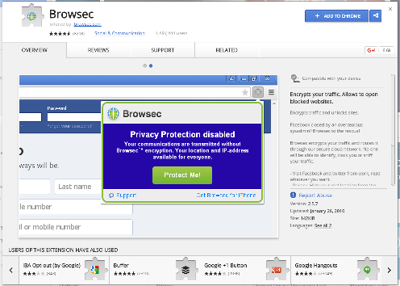
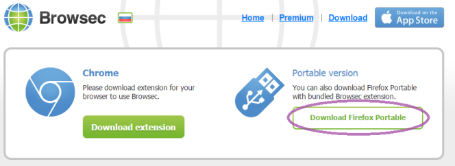
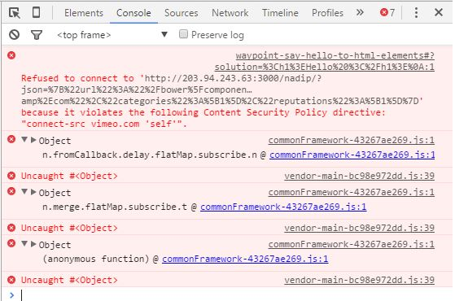
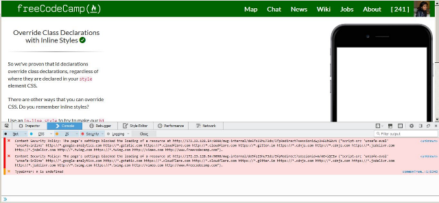

# Using Browsec for Securing your Connection to FreeCodeCamp.com

## Why do I need an plugin or add-on?

Lately some of the campers started facing strange problems, namely "Content Modification" by some Internet Service Providers (ISP), leading to the [FreeCodeCamp.com](http://freecodecamp.com) (FCC) website being broken sometimes.

This came to light with some of the issues logged by campers :

- [#5999 : Indian ISP's injecting Ads breaks site](https://github.com/FreeCodeCamp/FreeCodeCamp/issues/5999)
- [#6122 : Serious Problem using the FCC IDE, console showing error...](https://github.com/FreeCodeCamp/FreeCodeCamp/issues/6122)
- [#6381 : Unable to view the Code editor in the browser](https://github.com/FreeCodeCamp/FreeCodeCamp/issues/6381)

## TL;DR : What's Wrong, again?

Well, for some campers, this is a classic case of [man in the middle attack](https://en.wikipedia.org/wiki/Man-in-the-middle_attack).

For instance, as seen in the issue #5999, the ISP of some campers from India is deliberately injecting Ads into the user's visited websites that's causing problems.

While, in other cases, ISPs sometimes use a similar strategy to cache the websites visited by consumers, so that they can serve the cached content to other consumers visiting the same websites, this saves them bandwidth costs, while making websites available faster.

But when this is not done correctly (or is done malaciously as in the first case), this modifies essential content for websites, and prevents them from running properly.

## What's the fix, then?

Simple, we need to encrypt our connection to the FCC website. By encrypting our traffic we bypass the ISP's ability to modify or cache our content as it passes through their infrastructure.

This can be done with a useful browser add-on called [Browsec](https://browsec.com/en/).

### How does the add-on work?

The add-on creates a VPN connection between your device and the outside world. That is, Mr. Peeping Tom (ISP), can't mess with your connection to the FCC website. Its technically same as if you were not in your home, but accessing the FCC website from US, Netherlands, or other similar places.

_Behind the scenes it encrypts the data transmission, and hides your IP._

## I am sold, Show me the steps.

There you go!

### For Google Chrome :

#### Step 1 : Install the browsec extension.

You can [download and install the browsec plugin](https://chrome.google.com/webstore/detail/browsec/omghfjlpggmjjaagoclmmobgdodcjboh) for Chrome from the offical WebStore.

#### Step 2 : Clear your browser cookies and cache (optional).

It's a good thing if you clear your browser cache for the first time you are going to use browsec, so that your browser loads all the files from scratch.

#### Step 3 : Restart your browser, and visit [FreeCodeCamp.com](http://freecodecamp.com)

Just close your browser, and restart it. Check the browsec extention, for your desired endpoint location.

### For Mozilla Firefox :

Download a portable Firefox version, with bundled add-on, from the [Browsec website](https://browsec.com/en/dashboard/main).

That's it! Happy Coding! If this works then do let us know in the [Help Chat](https://gitter.im/FreeCodeCamp/Help)

## FAQs

### How do I know, if I am facing a "man in the middle" attack?

When you visit the FCC website, or do the challenges, if you look at your browser's Developer console (Press F12 > Console tab), you should see similar errors like below.

These are classic cases of the issue.

### Wait a minute, Can I use any alternate mechanism, to Browsec?

Yes, why not, you can use any available VPN clients in the market, but keep in mind that Browsec is free and works just great!

### Hey what about other browsers, Internet Explorer, Safari, e.t.c.?

Hmm, go for any VPN add-on that you can find for these browsers, [Tor](https://www.torproject.org/), is one such client, but they come with paid subscriptions, you can basically use any anonymizer that you want, however Chrome and Browsec are tried and tested and have worked for most campers in the past.

### Can I use the anonymizer for using websites other than FCC?

Of course yes. Why not? However remember that this does not make you invisible to law, so be careful of what you are doing! :wink:

### What if this doesn't work for me?

Please let us know in the [Help Chat](https://gitter.im/FreeCodeCamp/Help), we will try our best to find a workaround.

#### _Disclaimer_

**_FreeCodeCamp does NOT endorse any of the softwares mentioned in this article, please use them at your own discretion. Some VPN clients may track your activity, also there could be side-effects such as slow speeds or delay in page loads._**
